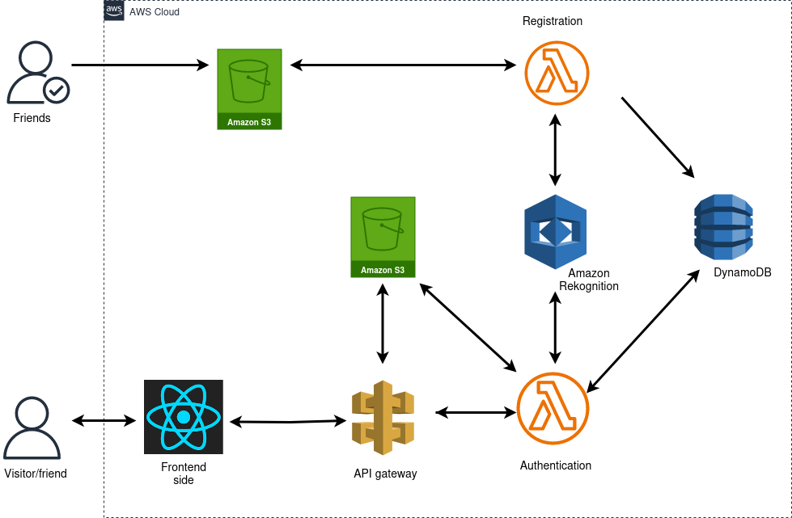

## Face Recognition using Amazon Rekognition

Other learners and myself have just concluded the 12-week <a href="https://www.emobilis.ac.ke/ajira">AWS re/start</a> program in Kenya and passed the <a href="https://drive.google.com/file/d/1SwHSs9bnefIQEW6oxnkGZmYyAxXnTtMy/view?usp=sharing">Certified Cloud Practitioner</a> exam 🎉

After long and fun weeks of learning, it would be an injustice to wrap up the program without an awesome project. Therefore, I thought of creating a project that invloves my friends and their faces 😀

### Project Motivation

I don't like it when people come to my place unannounced. My property manager has the decency to call me first and ask if I'm around before he pops in for whatever checks or maintenance he wants to do. 

To solve this little problem, I have come up with a small solution that detects and recognises people's faces on my door and compares with what I already have in the database.

### Application Architecture

The diagram below shows the architecture of the services used to implement this project

#### Flow of the architecture

The application has been divided into 2 parts:

1. Registration Flow

- A friend shows up, and because I don't want to ignore their door bells or knock another time, I take a photo of them and save it to an S3 bucket.
- The action of adding a photo in the S3 bucket triggers a registration lambda function that indexes the image to Amazon Rekognition.
- Amazon Rekognition, on the other hand, generates a unique key for each friend, along with a first and last name, which are then stored in the DynamoDB database.

2. Authentication Flow

- When a friend returns, or a visitor shows up, a photo of them is captured using the simple react application. 
- The react app then communicates with the API gateway to store the captured images in the second S3 bucket. This would be good for when I'd like to review the images later and add some of the visitors' images in the registration bucket for it to be added in the database.
- The S3 bucket triggers an authentication lambda function that indexes the image with Amazon Rekognition and compares the index with the existing ones in the database.
- If a match has been found, a success message is returned to the friend (a first and last name), else a failure message is returned to the visitor. 

### Further work
- Implement a mobile alert system that gets alerts from an installed camera.

#### References
